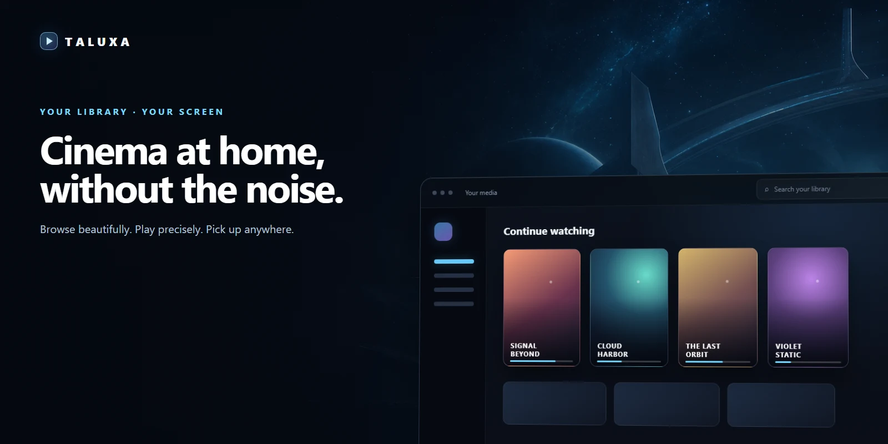
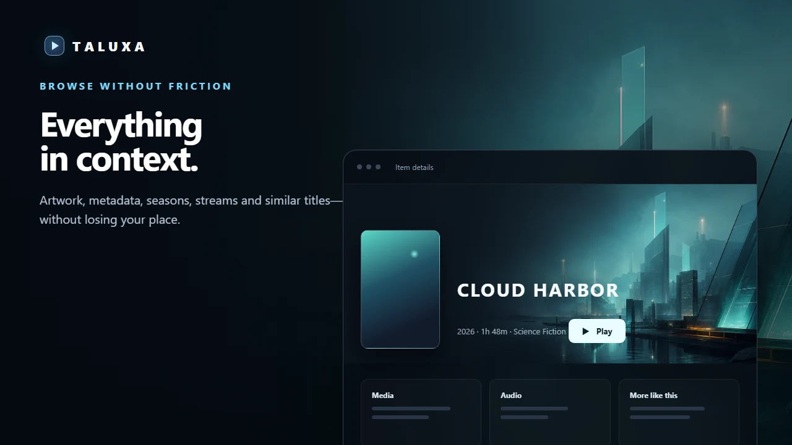
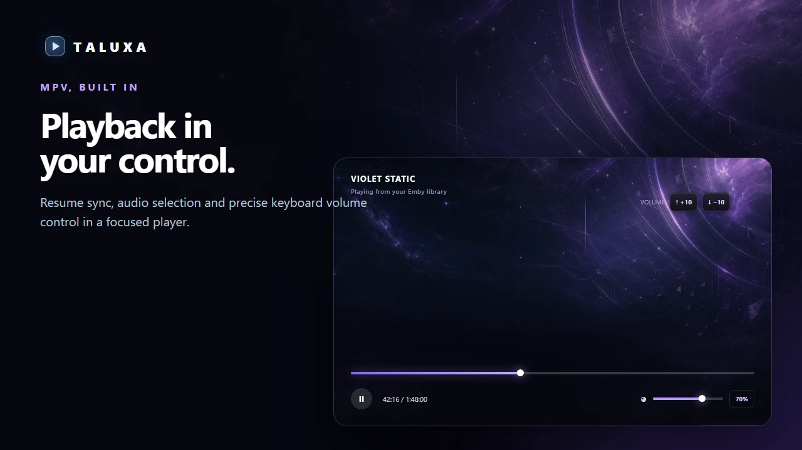

# Taluxa

简体中文 | [English](README.md)

Taluxa 是一款适用于 Windows 的桌面 Emby 客户端，基于 Electron、React、TypeScript 和 Vite 构建，并内置 mpv 播放能力。

Taluxa 专注于安静、流畅的桌面影音体验：保存多个 Emby 账户、以海报为核心的首页、快速媒体库浏览、全局搜索、完整的项目详情，以及支持续播和进度同步的外部 mpv 播放。



## 更从容的观看体验

### 浏览自然流畅

海报、元数据、剧集、分集、媒体流和相似内容集中呈现，浏览时无需来回跳转。



### 播放尽在掌控

内置 mpv 播放能力，续播进度、音轨选择和精准音量控制触手可及。



## 功能特性

- 基于 Electron 和 Vite 构建的 Windows 桌面应用
- 内置 mpv 运行时，无需单独安装播放器即可进行外部播放
- 自定义无边框标题栏，支持返回导航、全局搜索和窗口控制
- 自动设置开发依赖并选择可用端口
- 支持保存多个 Emby 账户并通过侧边栏快速切换
- 支持服务器显示名称和账户级设置
- 首页展示继续观看、媒体库和精选内容
- 媒体库和搜索结果支持海报加载失败时的降级处理
- 项目详情页支持背景主视觉、元数据、演职人员、季、集、相似内容和媒体流信息
- 多版本电影支持媒体源和音轨选择
- 将播放交给 mpv，同时保留 Taluxa 中的项目详情页
- 通过桌面桥接查询续播位置并上报播放进度
- 支持 Windows 系统代理、直连和自定义代理地址

## 技术栈

- Electron
- React
- TypeScript
- Vite
- Vitest
- mpv

## 开始使用

克隆仓库后，可直接启动开发环境：

```bash
npm run dev
```

首次运行时，开发脚本会检测本地是否缺少 Vite。若缺少，脚本会根据已提交的锁文件自动执行 `npm ci`，随后在可用的 `127.0.0.1` 端口上启动 Vite。后续运行检测到 Vite 已可用时，会跳过依赖安装。

如果希望在启动前显式安装依赖，请运行：

```bash
npm ci
npm run dev
```

如果现有依赖安装不完整或已经损坏，请删除 `node_modules`，执行 `npm ci`，然后重新运行开发命令。

## 可用脚本

```bash
npm run dev
```

在需要时安装锁定版本的依赖，然后通过自动端口选择器启动 Vite。

```bash
npm run test:dev-bootstrap
```

在不修改实际依赖安装的情况下，检查开发依赖的自动安装、跳过逻辑和失败处理。

```bash
npm test
```

运行 Vitest 测试套件。

```bash
npm run build
```

执行 TypeScript 类型检查，并构建渲染进程、Electron 主进程和预加载脚本。

```bash
npm run dist
```

构建应用，并使用 electron-builder 生成 Windows 安装程序。

## 项目结构

```text
src/electron/          Electron 主进程、预加载桥接、存储、代理和 mpv 集成
src/renderer/          React 应用、路由、页面、组件和样式
src/shared/            Emby API 客户端、共享模型、持久化辅助工具和通用工具
scripts/               开发辅助脚本
sources/               应用图标和 Logo 资源
vendor/mpv/windows-x64 内置的 Windows 版 mpv 运行时
```

## 手动验证

1. 运行 `npm run dev`。
2. 登录 Emby 服务器。
3. 确认首页能够加载继续观看、媒体库和精选内容。
4. 使用标题栏搜索电影或剧集。
5. 打开媒体库项目，确认详情页能够加载元数据和图片。
6. 对于包含多个版本或音轨的电影，在播放前选择所需版本和音轨。
7. 点击播放，确认 mpv 正常打开，同时 Taluxa 中仍保留项目详情页。
8. 关闭播放并重启应用，确认续播进度已保留。
9. 打开设置，确认账户、服务器名称、代理和退出登录功能正常。
10. 重启应用，确认已保存的账户能够恢复。

## 说明

- 本应用专为 Windows 设计。
- 播放由内置 mpv 负责。
- Emby 请求和海报图片会遵循当前配置的代理模式。
