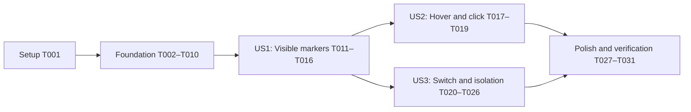

# Tasks: Playback Story Timeline Markers

**Input**: Design documents from `specs/014-story-timeline-markers/`

**Prerequisites**: [plan.md](./plan.md), [spec.md](./spec.md), [research.md](./research.md), [data-model.md](./data-model.md), [contracts/story-timeline-markers.md](./contracts/story-timeline-markers.md), [quickstart.md](./quickstart.md)

**Tests**: Required. The approved implementation plan uses TDD; every story phase starts with failing tests and ends with focused verification.

**Organization**: Tasks are grouped by user story so P1 can ship as the MVP, P2 adds interaction without changing retrieval, and P3 adds switching/failure guarantees without changing P1/P2 behavior.

## Format: `[ID] [P?] [Story] Description`

- **[P]**: Can run in parallel with other tasks explicitly identified in the dependency section because it changes different files and does not depend on their incomplete output.
- **[Story]**: Maps the task to User Story 1, 2, or 3 from `spec.md`.
- Every task includes an exact repository-relative file path.

---

## Phase 1: Setup and Baseline

**Purpose**: Capture the pre-feature state before any implementation changes. No new package or directory initialization is required.

- [x] T001 Run the existing playback/API baseline suites and record pass counts plus current direct/fallback startup timing in `specs/014-story-timeline-markers/quickstart.md`

Run:

```powershell
npm test -- src/shared/api/emby/library.test.ts src/electron/main/player/mpvController.test.ts src/renderer/app/router.playback-performance.test.tsx src/renderer/app/App.test.tsx
```

Expected: existing suites pass before story-marker tests are introduced; any pre-existing failure is recorded rather than attributed to this feature.

---

## Phase 2: Foundational — Shared Data and Player Command

**Purpose**: Establish the validated marker model, Emby normalization, asynchronous delivery primitive, and typed IPC command required by all three stories.

**Critical**: No user-story implementation begins until T002–T010 are complete.

### Tests First

- [x] T002 [P] Add failing runtime-validation tests for valid snapshots, empty clears, blank item ids, invalid times, duplicate/blank names, duplicate/unknown kinds, and malformed arrays in `src/shared/models/storyLandmark.test.ts`
- [x] T003 [P] Add failing Emby contract tests for authenticated URL construction, item/source chapter selection, marker-type mapping, tick conversion, duration filtering, sorting, one-second merging, fallback names, and de-duplication in `src/shared/api/emby/storyLandmarks.test.ts`
- [x] T004 [P] Add failing delivery tests for result-before-accept, accept-before-result, retrieval failure to empty, supersession, cancellation, exactly-once send, and send rejection containment in `src/renderer/features/player/storyMarkerDelivery.test.ts`

Run after T002–T004:

```powershell
npm test -- src/shared/models/storyLandmark.test.ts src/shared/api/emby/storyLandmarks.test.ts src/renderer/features/player/storyMarkerDelivery.test.ts
```

Expected: FAIL because the three production modules do not exist.

### Shared Implementation

- [x] T005 Implement `StoryLandmarkKind`, `StoryTimelineMarker`, `PlayerStoryMarkerUpdate`, and strict `isPlayerStoryMarkerUpdate` validation in `src/shared/models/storyLandmark.ts`
- [x] T006 [P] Implement official `ChapterInfo[]` source selection, `Chapter`/`IntroStart`/`CreditsStart` mapping, `IntroEnd` rejection, tick conversion, validation, sorting, and earliest-anchor one-second merging in `src/shared/api/emby/storyLandmarks.ts`
- [x] T007 [P] Implement `StoryMarkerDeliveryCoordinator.begin`, `accept`, `cancel`, failure-to-empty normalization, current-request checks, exactly-once flush, and send-error containment in `src/renderer/features/player/storyMarkerDelivery.ts`

### IPC Contract

- [x] T008 Add failing controller tests for active-item updates, pending-replacement updates, stale-item rejection, empty clears, and single-argument JSON integrity in `src/electron/main/player/mpvController.test.ts`
- [x] T009 Add `player:set-story-markers` typing and invocation in `src/electron/preload/index.ts` and `src/renderer/global.d.ts`, validate unknown payloads in `src/electron/main/index.ts`, and implement item-scoped `MpvController.setStoryMarkers` command forwarding in `src/electron/main/player/mpvController.ts`
- [x] T010 Run foundational tests and the TypeScript build, fixing only foundational contract issues in `src/shared/models/storyLandmark.ts`, `src/shared/api/emby/storyLandmarks.ts`, `src/renderer/features/player/storyMarkerDelivery.ts`, and the player IPC files

Run:

```powershell
npm test -- src/shared/models/storyLandmark.test.ts src/shared/api/emby/storyLandmarks.test.ts src/renderer/features/player/storyMarkerDelivery.test.ts src/electron/main/player/mpvController.test.ts
npm run build
```

Expected: all foundational tests pass and TypeScript/Vite build successfully.

**Checkpoint**: A valid Emby marker snapshot can be normalized, held until player acceptance, and sent safely to the matching active or pending mpv item. No visible marker behavior is required yet.

---

## Phase 3: User Story 1 — See Story Landmarks While Playing (Priority: P1) — MVP

**Goal**: Show all valid chapters, intro starts, and credits starts as uniform thin vertical markers at correct positions without delaying movie or episode playback.

**Independent Test**: Play an item exposing chapters plus intro/credits, open controls, and verify every valid point is rendered or included in the correct merged marker; play an item with no valid points and verify an empty usable timeline.

### Tests for User Story 1

- [x] T011 [P] [US1] Add failing generated-Lua tests for initial empty state, active item id, JSON update parsing, same-item replacement, thin vertical marker drawing, duration-relative x positioning, and resize recalculation in `src/electron/main/player/mpvController.test.ts`
- [x] T012 [P] [US1] Add failing initial-play integration tests for movies, episodes, selected media-source chapters, empty data, and retrieval failure delivering an empty snapshot in `src/renderer/app/App.test.tsx`
- [x] T013 [P] [US1] Add failing regression tests proving deferred landmark responses do not delay DirectPlay, PlaybackInfo fallback, preflight, or player launch milestones in `src/renderer/app/router.playback-performance.test.tsx`

Run after T011–T013:

```powershell
npm test -- src/electron/main/player/mpvController.test.ts src/renderer/app/router.playback-performance.test.tsx src/renderer/app/App.test.tsx
```

Expected: FAIL on missing Lua marker rendering and route delivery integration while existing playback assertions remain intact.

### Implementation for User Story 1

- [x] T014 [US1] Add `mp.utils`, `active_item_id`, empty `story_markers`, item-guarded `taluxa-story-markers` JSON parsing, invalid-payload clearing, and duration-relative thin marker drawing before the seek hitbox in `src/electron/main/player/mpvController.ts`
- [x] T015 [US1] Create one route-scoped `StoryMarkerDeliveryCoordinator`, start its loader from the already-running source promise, pass exact mediaSourceId/runtime/account context, accept on launch-ready, and cancel on launch/source/preflight/account failure in `src/renderer/app/router.tsx`
- [x] T016 [US1] Run the complete User Story 1 suites and fix only P1 visibility/non-blocking regressions in `src/electron/main/player/mpvController.ts`, `src/renderer/app/router.tsx`, `src/renderer/app/router.playback-performance.test.tsx`, and `src/renderer/app/App.test.tsx`

Run:

```powershell
npm test -- src/shared/models/storyLandmark.test.ts src/shared/api/emby/storyLandmarks.test.ts src/renderer/features/player/storyMarkerDelivery.test.ts src/electron/main/player/mpvController.test.ts src/renderer/app/router.playback-performance.test.tsx src/renderer/app/App.test.tsx
```

Expected: PASS; P1 works independently as the MVP and existing startup timing thresholds remain green.

**Checkpoint**: Movies and episodes show correctly merged, uniformly styled story markers; empty/failing chapter responses do not delay or break playback.

---

## Phase 4: User Story 2 — Identify and Jump to a Landmark (Priority: P2)

**Goal**: Reveal every distinct merged name above a marker within 250 ms and seek to the marker time on click without breaking ordinary timeline seeking.

**Independent Test**: Hover individual and merged markers to verify their names, click them to verify playback lands within one second, then click empty progress-bar regions to verify proportional seek still works.

### Tests for User Story 2

- [x] T017 [US2] Add failing generated-Lua tests for a wider invisible marker hit target registered before seek, merged-name tooltip positioning, mouse-move redraw, marker click priority, bounded time-pos assignment, and unchanged ordinary seek behavior in `src/electron/main/player/mpvController.test.ts`

Run:

```powershell
npm test -- src/electron/main/player/mpvController.test.ts
```

Expected: FAIL because markers are visible but have no hover/click interaction.

### Implementation for User Story 2

- [x] T018 [US2] Extend marker drawing with closest-marker hover detection, clamped `names.join(' · ')` label placement, 12–16 px hit targets, stored marker values, click-before-seek handling, and immediate `MOUSE_MOVE` redraw in `src/electron/main/player/mpvController.ts`
- [x] T019 [US2] Run the mpv interaction suite and record automated hover/click coverage status in `specs/014-story-timeline-markers/quickstart.md`

Run:

```powershell
npm test -- src/electron/main/player/mpvController.test.ts
```

Expected: PASS for marker hover/click and all existing seek, pause, volume, resize, audio, subtitle, danmaku, and episode-control assertions.

**Checkpoint**: Visible markers are identifiable and clickable while non-marker timeline areas retain normal behavior.

---

## Phase 5: User Story 3 — Keep Markers Correct Across Playback Changes (Priority: P3)

**Goal**: Clear outgoing markers during switching and prevent late, failed, cancelled, or cross-account results from changing the active item's timeline.

**Independent Test**: Rapidly switch between items with different, empty, delayed, and failing marker responses; verify only the accepted active item's markers can appear or be selected and playback remains usable.

### Tests for User Story 3

- [x] T020 [P] [US3] Add failing controller/Lua tests for active-episode atomic clear, incoming pending-item acceptance, stale current-item rejection after promotion, invalid JSON clearing, and command ordering around switch in `src/electron/main/player/mpvController.test.ts`
- [x] T021 [P] [US3] Extend coordinator tests for rapid A→B supersession, accept-after-cancel, old-account cancellation, late empty/failure results, and no unhandled send rejection in `src/renderer/features/player/storyMarkerDelivery.test.ts`
- [x] T022 [P] [US3] Add failing integration tests for episode switch, rapid A→B with late A response, no-marker incoming item, retrieval failure, failed switch, route unmount, and account/server change in `src/renderer/app/App.test.tsx`
- [x] T023 [P] [US3] Add failing performance tests proving landmark loading is excluded from episode source resolution, preflight, and switch acceptance timing in `src/renderer/app/router.playback-performance.test.tsx`

Run after T020–T023:

```powershell
npm test -- src/renderer/features/player/storyMarkerDelivery.test.ts src/electron/main/player/mpvController.test.ts src/renderer/app/router.playback-performance.test.tsx src/renderer/app/App.test.tsx
```

Expected: FAIL on missing atomic switch clearing and missing switch-generation/account cleanup guards.

### Implementation for User Story 3

- [x] T024 [US3] Make `taluxa-active-episode` assign the incoming item id and clear markers before reset/redraw, and enforce active/pending item acceptance throughout `MpvController.setStoryMarkers` in `src/electron/main/player/mpvController.ts`
- [x] T025 [US3] Add an episode-switch generation guard, begin landmark loading from the independent next-source promise, accept only after successful switch, cancel superseded/failed/unmounted/account-changed requests, and prevent stale route state commits in `src/renderer/app/router.tsx`
- [x] T026 [US3] Run the complete User Story 3 suites and fix only switching, failure, stale-result, or isolation regressions in `src/renderer/features/player/storyMarkerDelivery.ts`, `src/electron/main/player/mpvController.ts`, and `src/renderer/app/router.tsx`

Run:

```powershell
npm test -- src/shared/api/emby/storyLandmarks.test.ts src/renderer/features/player/storyMarkerDelivery.test.ts src/electron/main/player/mpvController.test.ts src/renderer/app/router.playback-performance.test.tsx src/renderer/app/App.test.tsx
```

Expected: PASS with zero stale/cross-account marker deliveries and no unhandled rejection.

**Checkpoint**: All three user stories work; switching, failure, and account changes cannot expose another item's markers.

---

## Phase 6: Polish and Cross-Cutting Verification

**Purpose**: Prove full regression safety, build correctness, scope, security, and manual Emby/mpv behavior.

- [x] T027 Run all focused feature suites together and resolve only uncovered specification gaps in `src/shared/models/storyLandmark.test.ts`, `src/shared/api/emby/storyLandmarks.test.ts`, `src/renderer/features/player/storyMarkerDelivery.test.ts`, `src/electron/main/player/mpvController.test.ts`, `src/renderer/app/router.playback-performance.test.tsx`, and `src/renderer/app/App.test.tsx`
- [x] T028 Run the full Vitest suite and repair story-marker regressions without weakening existing assertions in `src/`
- [x] T029 Run the production build, `git diff --check`, changed-file scope review, and credential scan, recording any required remediation in `specs/014-story-timeline-markers/quickstart.md`
- [ ] T030 Perform every manual chapter, hover, click, resize, dense-timeline, switch, failure, performance, and security scenario and record server/version/item/timing results in `specs/014-story-timeline-markers/quickstart.md`
- [x] T031 Compare FR-001–FR-019 and SC-001–SC-008 against test/manual evidence and record final coverage or remaining deviations in `specs/014-story-timeline-markers/checklists/requirements.md`

Verification commands:

```powershell
npm test -- src/shared/models/storyLandmark.test.ts src/shared/api/emby/storyLandmarks.test.ts src/renderer/features/player/storyMarkerDelivery.test.ts src/electron/main/player/mpvController.test.ts src/renderer/app/router.playback-performance.test.tsx src/renderer/app/App.test.tsx
npm test
npm run build
git diff --check
git diff --name-only
rg -n "api_key=|X-Emby-Token.*token-|MediaBrowser Token=.*token-" src specs/014-story-timeline-markers
```

Expected: zero failed tests, successful TypeScript/Vite build, no whitespace errors, planned file scope only, and no real credential in source, persisted data, rendered labels, logs, or marker IPC.

---

## Dependencies and Execution Order

### Phase Dependencies

- **Phase 1 — Setup**: Starts immediately.
- **Phase 2 — Foundational**: Depends on T001 and blocks every user story.
- **Phase 3 — US1**: Depends on T002–T010 and produces the MVP.
- **Phase 4 — US2**: Depends on the P1 marker drawing surface from T014; it does not depend on P3 switching behavior.
- **Phase 5 — US3**: Depends on foundational delivery and the P1 marker update surface; it does not depend on P2 hover/click behavior.
- **Phase 6 — Polish**: Depends on all desired user stories.

### User Story Completion Graph



### Foundational Task Dependencies

- T002, T003, and T004 can be written in parallel.
- T005 depends on T002.
- T006 depends on T003 and T005.
- T007 depends on T004 and T005; T006 and T007 can then run in parallel.
- T008 depends on T005.
- T009 depends on T008 and T005.
- T010 depends on T005–T009.

### Within Each User Story

- Tests must be written and observed failing before implementation begins.
- US1: T011–T013 can run in parallel; T014 depends on T011; T015 depends on T012–T013 and foundational T007/T009; T016 depends on T014–T015.
- US2: T017 precedes T018; T019 verifies both.
- US3: T020–T023 can run in parallel; T024 depends on T020; T025 depends on T021–T023; T026 depends on T024–T025.

---

## Parallel Execution Examples

### Foundation

```text
Task T002: Model guard tests in src/shared/models/storyLandmark.test.ts
Task T003: Emby normalization tests in src/shared/api/emby/storyLandmarks.test.ts
Task T004: Delivery coordinator tests in src/renderer/features/player/storyMarkerDelivery.test.ts
```

After T005:

```text
Task T006: Emby normalization in src/shared/api/emby/storyLandmarks.ts
Task T007: Delivery coordinator in src/renderer/features/player/storyMarkerDelivery.ts
```

### User Story 1

```text
Task T011: mpv display contract tests in src/electron/main/player/mpvController.test.ts
Task T012: initial-play integration tests in src/renderer/app/App.test.tsx
Task T013: startup performance tests in src/renderer/app/router.playback-performance.test.tsx
```

### User Story 2

US2 changes one tightly coupled generated-Lua file, so T017–T019 remain sequential to preserve the red/green cycle.

### User Story 3

```text
Task T020: controller/Lua switch tests in src/electron/main/player/mpvController.test.ts
Task T021: delivery race tests in src/renderer/features/player/storyMarkerDelivery.test.ts
Task T022: app switching integration in src/renderer/app/App.test.tsx
Task T023: switch performance tests in src/renderer/app/router.playback-performance.test.tsx
```

---

## Implementation Strategy

### MVP First — User Story 1

1. Complete T001 baseline.
2. Complete T002–T010 foundation.
3. Complete T011–T016 visible-marker story.
4. Stop and validate P1 independently with movie, episode, empty data, failure, and non-blocking startup cases.
5. Demonstrate the MVP before adding hover/click and advanced switching guarantees.

### Incremental Delivery

1. **Foundation**: Validated Emby-to-player snapshot pipeline.
2. **US1/P1**: Visible uniform markers without startup regression.
3. **US2/P2**: Hover labels and click-to-seek while preserving ordinary seek.
4. **US3/P3**: Atomic switch clearing, stale-result defense, and account/failure isolation.
5. **Polish**: Full suite, build, security review, and manual Emby evidence.

### Suggested Commit Boundaries

- T002–T005: `feat: define story timeline marker model`
- T003/T006: `feat: load Emby story landmarks`
- T004/T007: `feat: coordinate story marker delivery`
- T008–T010: `feat: send item-scoped story markers to mpv`
- T011/T014: `feat: render story markers in mpv`
- T012–T016: `feat: load story markers without delaying playback`
- T017–T019: `feat: make story markers interactive`
- T020–T026: `feat: isolate story markers across playback changes`
- T027–T031: `test: verify playback story timeline markers`

---

## Notes

- `[P]` means the task is safe to execute concurrently only under the dependencies listed above.
- Story labels provide traceability to the specification; setup, foundation, and polish tasks intentionally have no story label.
- Keep credentials inside the existing Emby request wrapper; never add them to marker DTOs, IPC payloads, Lua state, logs, or persistence.
- Do not add automatic skipping, shaded ranges, skip buttons, persistence, new dependencies, or unrelated player refactors.
- Do not weaken startup, progress synchronization, or existing player-control tests to make marker tests pass.
