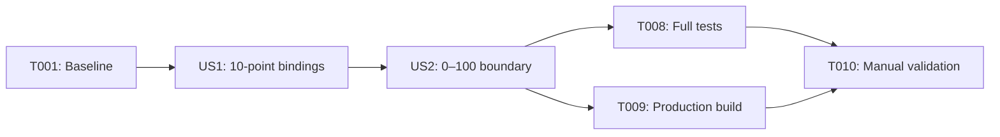

# Tasks: Player Arrow-Key Volume Control

**Input**: Design documents from `specs/016-adjust-volume-keys/`

**Prerequisites**: `plan.md`, `spec.md`, `research.md`, `data-model.md`, `contracts/keyboard-volume.md`, `quickstart.md`

**Tests**: Included because the implementation plan requires test-first changes and the UI contract defines automated verification.

**Organization**: Tasks are grouped by user story so the 10-point shortcut can be delivered as the MVP before adding explicit 0–100 boundary enforcement.

## Format: `[ID] [P?] [Story] Description`

- **[P]**: Can run in parallel because it uses a different verification path and has no incomplete-task dependency
- **[Story]**: Maps the task to User Story 1 or User Story 2
- Every task includes the exact file path it affects or verifies

## Phase 1: Setup (Shared Infrastructure)

**Purpose**: Confirm the existing focused harness is green before starting the red-green implementation cycle.

- [x] T001 Run `.\node_modules\.bin\vitest.cmd run src/electron/main/player/mpvController.test.ts` and confirm the baseline passes for `src/electron/main/player/mpvController.test.ts`

---

## Phase 2: Foundational (Blocking Prerequisites)

**Purpose**: Reuse the existing `MpvController` input-config generator, process-argument builder, and `writeTextFile` test harness.

No new foundational code or infrastructure is required. T001 confirms the shared foundation before either story begins.

**Checkpoint**: Existing mpv launch and generated-file test infrastructure is ready.

---

## Phase 3: User Story 1 - Use Arrow Keys to Adjust Volume (Priority: P1) 🎯 MVP

**Goal**: Pressing Up increases volume by 10 and pressing Down decreases volume by 10 in the active native player window.

**Independent Test**: Start at volume 40, press Up once to reach 50, then press Down once to return to 40.

### Tests for User Story 1

> Write T002 first and confirm the new assertions fail before T003.

- [x] T002 [US1] Add failing generated-input assertions for exactly one `UP add volume 10` binding, exactly one `DOWN add volume -10` binding, preserved F6–F10 bindings, and no Left/Right override in `src/electron/main/player/mpvController.test.ts`

### Implementation for User Story 1

- [x] T003 [US1] Add the Up and Down 10-point volume bindings to `createMpvInputConfig()` in `src/electron/main/player/mpvController.ts`
- [x] T004 [US1] Run the focused Vitest command and confirm the User Story 1 assertions pass in `src/electron/main/player/mpvController.test.ts`

**Checkpoint**: The active mpv window supports 10-point Up/Down volume adjustment while existing custom and seek bindings remain intact.

---

## Phase 4: User Story 2 - Safe Adjustment at Volume Boundaries (Priority: P2)

**Goal**: Repeated and near-boundary adjustments remain within the user-facing 0–100 range.

**Independent Test**: From 95, Up lands on 100 and remains there on another Up; from 5, Down lands on 0 and remains there on another Down.

### Tests for User Story 2

> Write T005 first and confirm the new assertion fails before T006.

- [x] T005 [US2] Add a failing mpv launch-contract assertion for exactly one `--volume-max=100` argument while preserving the existing argument list in `src/electron/main/player/mpvController.test.ts`

### Implementation for User Story 2

- [x] T006 [US2] Add `--volume-max=100` to the per-session mpv launch arguments in `src/electron/main/player/mpvController.ts`
- [x] T007 [US2] Run the focused Vitest command and confirm the boundary launch contract passes in `src/electron/main/player/mpvController.test.ts`

**Checkpoint**: User Stories 1 and 2 work together, with repeatable 10-point changes clamped to 0–100 by mpv.

---

## Phase 5: Polish & Cross-Cutting Concerns

**Purpose**: Verify regressions, build integrity, visible feedback, repeat behavior, and the complete quickstart flow.

- [x] T008 [P] Run `npm test` and resolve any regression attributable to the feature in `src/electron/main/player/mpvController.ts` or `src/electron/main/player/mpvController.test.ts`
- [x] T009 [P] Run `npm run build` and resolve any type or production-build failure attributable to `src/electron/main/player/mpvController.ts`
- [ ] T010 Complete post-fix manual scenarios, including 40→50→40, boundaries, held-key repeat, silent native OSD, click/drag endpoints, knob tooltip, top-titlebar dragging, window buttons, center click, video double-click, Left/Right, F6–F10, and mouse wheel; record results in `specs/016-adjust-volume-keys/quickstart.md`
- [x] T011 Add failing contracts for suppressing native keyboard volume OSD and remove redundant top-left volume text.
- [x] T012 Implement click and continuous drag mapping for the bottom volume track with 0–100 clamping.
- [x] T013 Preserve click semantics, canceled releases, nil pointer handling, and control visibility throughout dragging.
- [x] T014 Show the current integer volume above the knob on hover or during dragging using the time-label font size.
- [x] T015 Reproduce the 3px handoff to mpv built-in window dragging and trace the canceled complex binding.
- [x] T016 Add a failing contract that disables automatic window dragging while preserving a dedicated top-titlebar drag path.
- [x] T017 Launch mpv with `--input-builtin-dragging=no` and call `begin-vo-dragging` only from the top 54px non-button region.
- [x] T018 Confirm bundled mpv compatibility with both the launch option and explicit drag command.
- [x] T019 Re-run the focused controller test: 50/50 passed.
- [x] T020 Re-run the full suite and production build: 497/497 passed and build succeeded.

---

## Dependencies & Execution Order

### Phase Dependencies

- **Setup (Phase 1)**: Starts immediately.
- **Foundational (Phase 2)**: Requires the T001 baseline; no code changes are needed.
- **User Story 1 (Phase 3)**: Starts after the baseline and delivers the MVP.
- **User Story 2 (Phase 4)**: Depends on User Story 1 because boundary behavior is exercised through the new bindings.
- **Polish (Phase 5)**: Starts after both stories pass their focused tests.

### User Story Dependency Graph



### Within Each User Story

- Add the failing contract assertion before production changes.
- Confirm failure is caused by the missing requested behavior.
- Implement only the behavior owned by that story.
- Re-run the focused test before moving to the next story.

### Parallel Opportunities

- T008 and T009 can run in parallel after T007 because they verify independent test and build paths.
- User-story implementation tasks are intentionally sequential because both stories update the same controller and test files.

---

## Parallel Example: Final Verification

```text
Task T008: Run the full Vitest suite from package.json.
Task T009: Run the TypeScript/Vite production build from package.json.
```

Wait for both tasks before starting T010.

---

## Implementation Strategy

### MVP First (User Story 1 Only)

1. Complete T001.
2. Complete T002 and observe the expected failure.
3. Complete T003.
4. Complete T004 and validate the 40→50→40 flow.
5. Stop here if only the core shortcut is required for an MVP demonstration.

### Incremental Delivery

1. Baseline → existing player contract confirmed.
2. User Story 1 → Up/Down apply 10-point changes.
3. User Story 2 → changes clamp at 0 and 100.
4. Polish → full regression, build, and native-player verification.

---

## Notes

- Do not add renderer key listeners; the native mpv window owns keyboard focus.
- Do not change the existing mouse-wheel delta of 5.
- Do not add custom OSD messages unless manual verification proves normal mpv feedback is absent.
- Do not modify persisted `defaultVolume` settings or add IPC contracts.
- Commit only after a story checkpoint or another logical group is verified.
